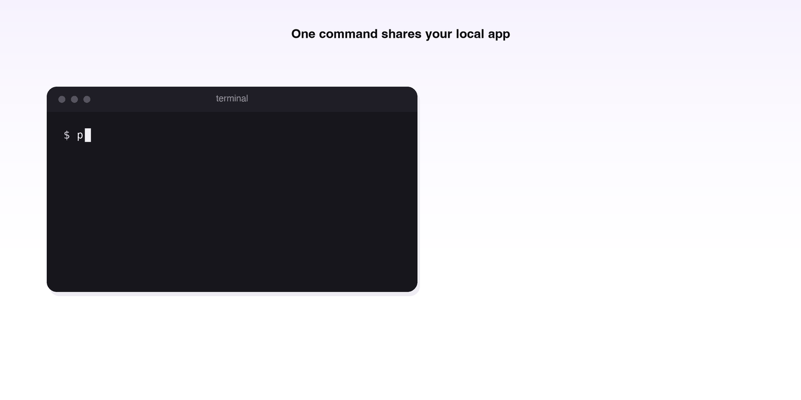

# PunchPage

**Like ngrok, but peer-to-peer.** Share a local web app through a plain browser URL — no server, no account, end-to-end encrypted.



## Install

macOS / Linux:

```sh
curl -fsSL https://punchpage.pages.dev/install.sh | sh
```

Windows (PowerShell):

```powershell
powershell -c "irm https://punchpage.pages.dev/install.ps1 | iex"
```

## Use

```sh
punch 3000                    # share http://127.0.0.1:3000
punch localhost:8080          # or a host:port
punch http://localhost:8080   # or a full URL
punch demo                    # or try the built-in demo site
```

Send the printed link to anyone. Their browser connects straight to your machine over WebRTC — requests, uploads, cookies, SSE, and WebSockets all work. See `punch -h` for all flags.

Agent-ready — paste this to your AI assistant and it will do the rest:

```text
Share my local app on port 3000 with PunchPage, then give me the link.
Instructions: https://punchpage.pages.dev/llms.txt
```

## What it's for

Handing your localhost to a person: demos, design reviews, opening your app on your phone, sharing a dashboard with a colleague. The link dies when you stop `punch`, and end-to-end encryption means nothing in between can read the traffic.

## What it's not for

Being publicly reachable. No server in the middle means no public endpoint: webhooks, OAuth callbacks, and always-on hosting won't work — the visitor must be a browser. For those, use a relay-based tunnel like ngrok or cloudflared.

## Docs

- [Architecture](docs/ARCHITECTURE.md) — how the tunnel works
- [Security](docs/SECURITY.md) — threat model and limitations
- [Building](docs/BUILDING.md) — build and test from source
- [Deployment](docs/DEPLOYMENT.md) — hosting, secrets, and releases

## License

MIT
